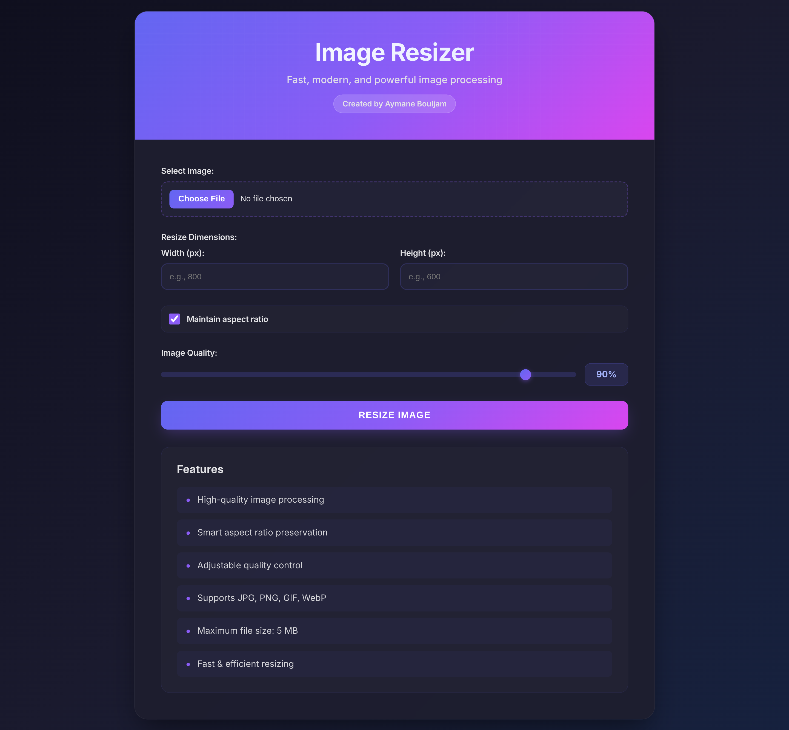

# Image Resizer

A lightweight PHP image resizer service with a modern web interface for uploading and resizing images with quality control and aspect ratio preservation.



## Overview

Image Resizer is a web-based tool that allows users to upload images and resize them to custom dimensions while maintaining control over quality and aspect ratio. Built with PHP 8.0+ and Intervention Image library, it provides fast and efficient image processing with a clean, modern interface.

## Features

- High-quality image processing using Intervention Image library
- Support for multiple image formats: JPG, PNG, GIF, WebP
- Configurable width and height dimensions
- Smart aspect ratio preservation option
- Adjustable quality control (10-100%)
- Maximum file size validation (5MB)
- MIME type and file extension validation
- Modern gradient-based UI with responsive design
- Real-time image preview and download

## Technical Stack

- PHP 8.0+
- Intervention Image 3.0
- GD Extension
- Pest for testing
- PHPStan for static analysis
- Laravel Pint for code formatting
- Monolog for logging

## Requirements

- PHP 8.0 or higher
- GD extension
- Composer

## Installation

Install dependencies using Composer:

```bash
composer install
```

Create required symlinks:

```bash
composer setup
```

## Usage

Start the development server:

```bash
composer serve
```

The application will be available at `http://localhost:8000`.

### Uploading and Resizing Images

1. Select an image file (JPG, PNG, GIF, or WebP)
2. Enter desired width and/or height in pixels
3. Toggle aspect ratio preservation if needed
4. Adjust quality using the slider (default: 90%)
5. Click "Resize Image"
6. Download or view the resized image

## Project Structure

```
image-resizer/
├── public/              # Public web root
│   └── index.php        # Frontend interface
├── src/                 # Application logic
│   ├── upload.php       # Image upload and resize handler
│   └── Logger.php       # Logging utility
├── tests/               # Test suite
│   ├── Feature/         # Feature tests
│   └── Unit/            # Unit tests
├── uploads/             # Uploaded images directory
├── resized/             # Resized images directory
├── logs/                # Application logs
└── vendor/              # Dependencies
```

## Configuration

Maximum file size and allowed types are configured in `src/upload.php`:

```php
const MAX_FILE_SIZE = 5 * 1024 * 1024;
const ALLOWED_TYPES = ['image/jpeg', 'image/png', 'image/gif', 'image/webp'];
const ALLOWED_EXTENSIONS = ['jpg', 'jpeg', 'png', 'gif', 'webp'];
```

## Development

### Running Tests

Run the full test suite:

```bash
composer test
```

Run tests with coverage:

```bash
composer test:coverage
```

### Code Quality

Run static analysis:

```bash
composer analyse
```

Format code:

```bash
composer format
```

Check code formatting:

```bash
composer format:check
```

Run all quality checks:

```bash
composer quality
```

## Image Processing

The application uses Intervention Image library with the GD driver for image manipulation. Images are processed with the following options:

- Aspect ratio preservation using the `scale()` method
- Direct resize without aspect ratio using the `resize()` method
- Quality control for JPEG and WebP formats
- Automatic format detection and handling

## Security

- File size validation (5MB maximum)
- MIME type validation
- File extension validation
- Secure file upload handling
- Input sanitization and validation


